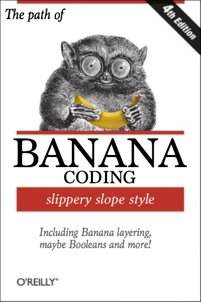

BananaKit
=========

**BananaKit** is an appealing abstraction of common patterns and tools that were extracted from some of the largest and most successful apps in the app store. Peel requests welcome.

##Upcoming subprojects:

- **CoreBanana**: A semi-persistence framework. Your data decays over a period of 3-4 days and bruises easily when manipulated.
- **Split**: A/B testing. Works best on a Sunday, when there is lower usage.
- **Smoothie**: Integration testing tools. Slippin up bugs one at a time. Provides 3D visualization of test coverage (requires Blender).
- **AsyncBanana**: Easy to use wrappers for GCD and NSOperation.
- **Musa**:  Dependency, Module, Command and View management.
- **Banana Coding**: Elements of Non-Reusable Object-Oriented Software is a software engineering book describing recurring problems to common solutions in software design.

 &copy; Fredrik Dahlen

Originally developed by [@modocache](https://twitter.com/modocache), BananaKit is also an indispensible bunch of concepts for talking about code.
